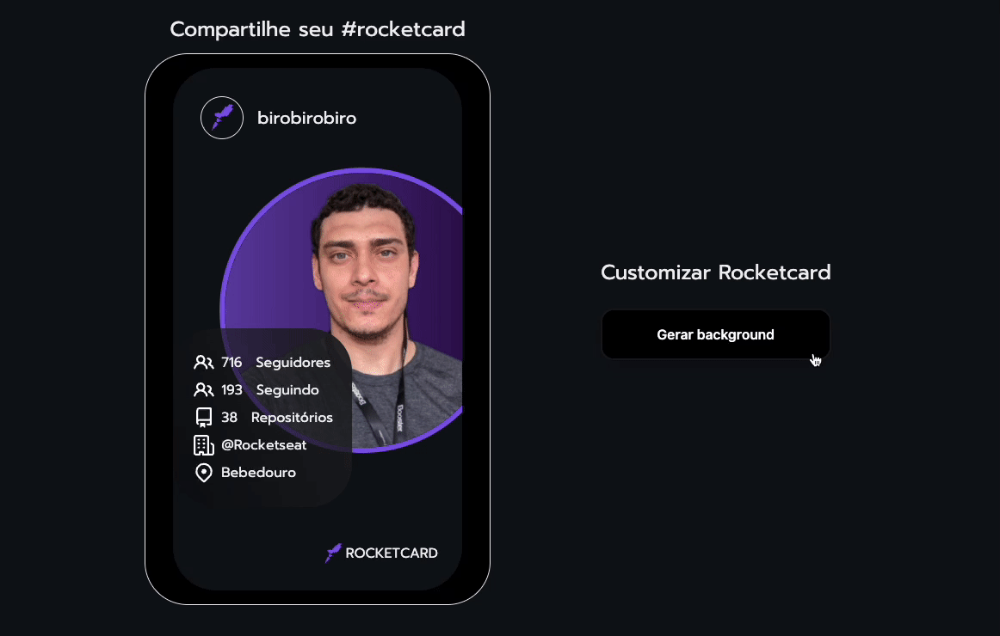

<h1 align="center"> Rocketcard </h1>
 

  

## 💻 Projeto

Neste desafio você deverá desenvolver um card que traga as informações da API do Github e tenha um botão que altere a cor do fundo do card.

## 🚀 Tecnologias

Esse projeto foi desenvolvido com as seguintes tecnologias:

- HTML e CSS
- Javascript
- Git e Github
- Figma

## ✅ Requisitos

- Consumir API do Github;
- Ter um botão que altere a cor de fundo;